# 🏥 CareFlow – Hospital Appointment Management System

CareFlow is a full-stack hospital appointment management platform designed to streamline patient-doctor interactions, appointment scheduling, and hospital administration. 
The system provides dedicated interfaces for both patients and administrators, enabling efficient healthcare management through a modern and intuitive web application.

---

## 🌐 Live Demo

https://medicare-self-gamma.vercel.app/

---

## 🚀 Features

### 👤 Patient Module

- User Registration & Login Authentication
- View Doctor Profiles & Specializations
- Real-Time Doctor Availability Status
- Book Appointments with Preferred Doctors
- Appointment Summary Before Confirmation
- Manage Personal Profile Information
- View Appointment History
- Cancel Scheduled Appointments
- Explore Hospital Gallery
- Hospital Information & Contact Section
- Responsive and User-Friendly Interface

---

### 👨‍⚕️ Doctor Management

- Doctor Listing with Detailed Profiles
- Qualification Information
- Specialization Details
- Consultation Fees
- Experience Information
- Availability Tracking
- Doctor Profile Pages
- Appointment Records Linked to Doctors

---

### 🛠️ Admin Module

#### Dashboard

- Total Doctors, Patients and Users Overview
- Total Appointments Overview
- Pending and Confirmed Appointment Statistics

#### Patient Management

- View All Registered Patients
- Patient Profile Details
- Appointment History Tracking
- User Information Monitoring

#### Doctor Management

- Add, Edit and Delete Doctors
- Manage Doctor Availability
- View Doctor Appointment Records

#### Appointment Management

- View All Appointments
- Track Appointment Workflow
- Appointment Status Monitoring
- Confirm, Complete or Cancel Appointments

---

## 🚀 Tech Stack

### Frontend

- Next.js 16
- React 19
- Tailwind CSS 4
- Lucide React
- React Hot Toast

### Backend

- Next.js App Router
- API Routes
- Server Components

### Database & ORM

- Prisma ORM
- SQL Database

### Authentication & Security

- JWT Authentication
- JOSE
- bcryptjs

### Additional Tools

- Cloudinary
- Day.js

---

## 🔑 Admin Credentials

```bash
Email: ayeshansari124@gmail.com
Password: ayesha
```

---

# 📸 Screenshots

## 👤 Patient Side

### 🏠 Homepage
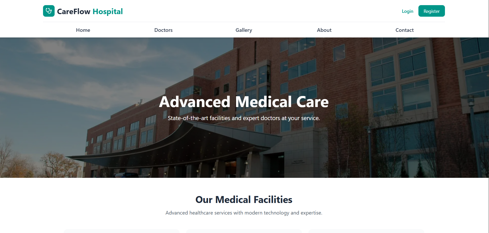

---

### 👨‍⚕️ Doctors Listing
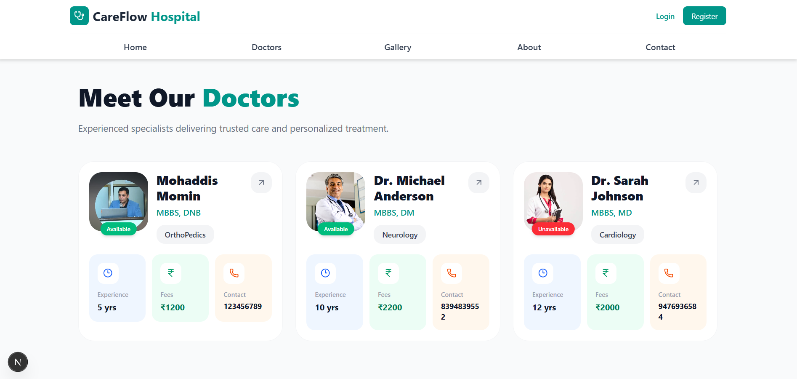

---

### 📋 Doctor Details
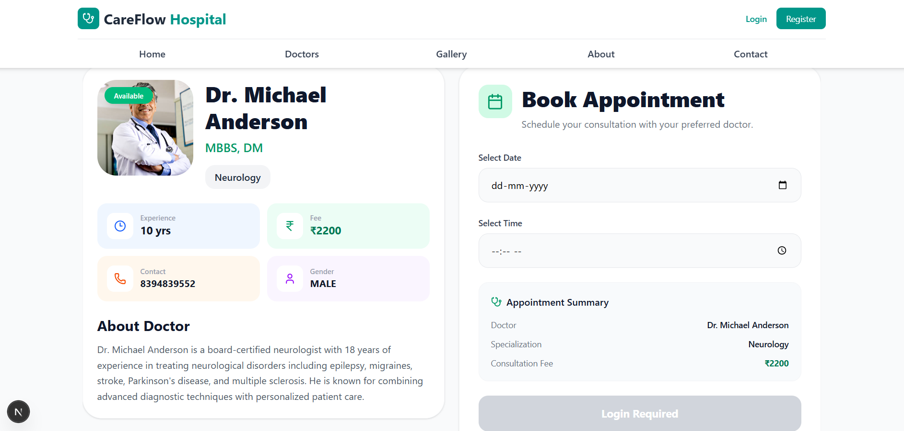

---

### 🔐 Login & Registration
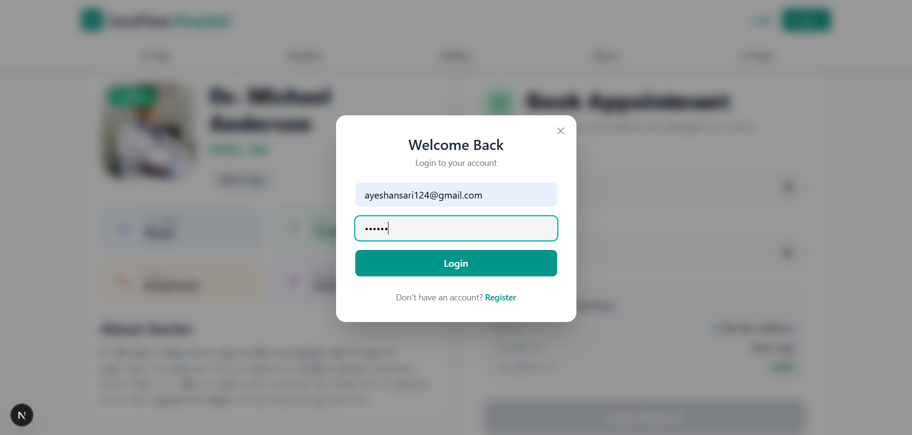

---

### 📅 Appointment Booking
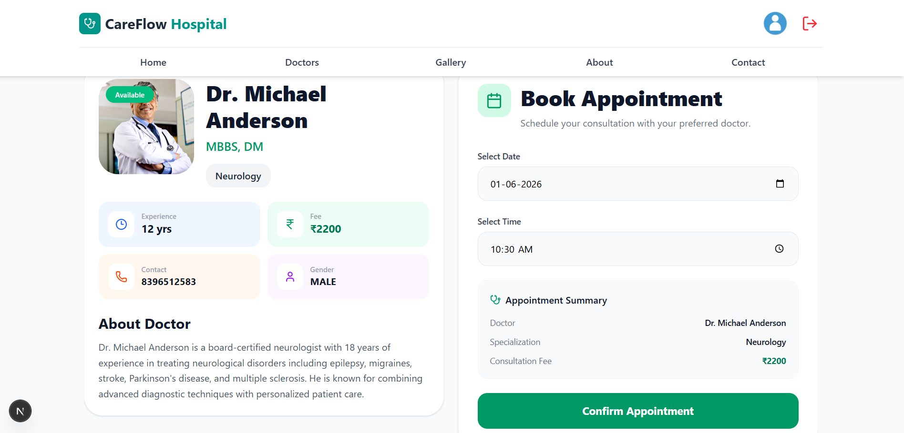

---

### 👤 Patient Profile
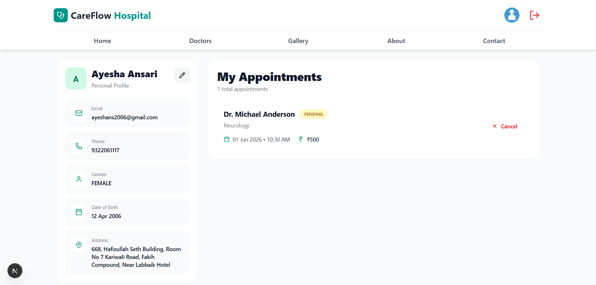

---

### 🖼️ Gallery Page
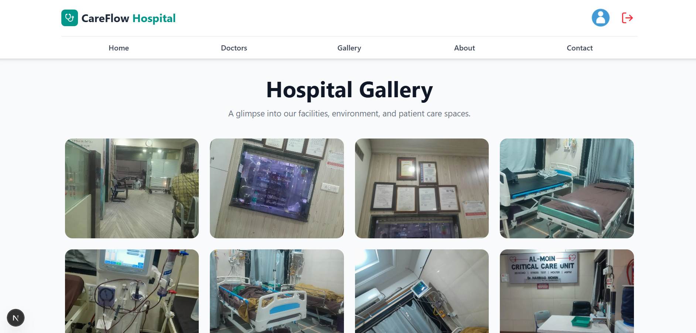

---

### ℹ️ About Page
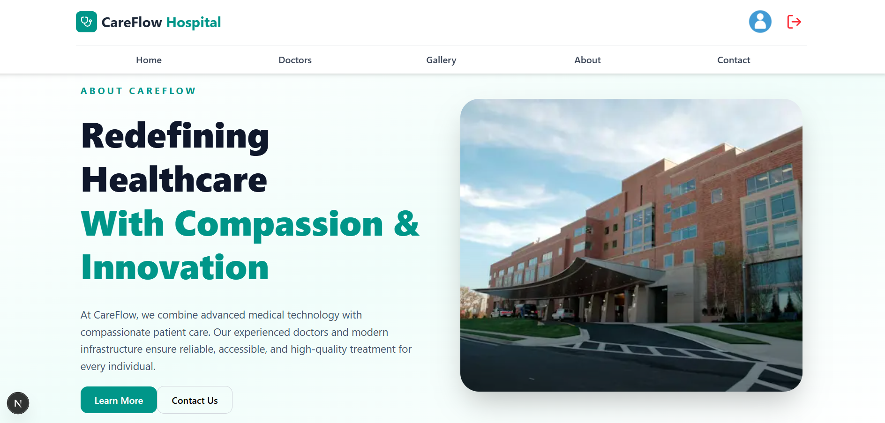

---

### 📞 Contact Page
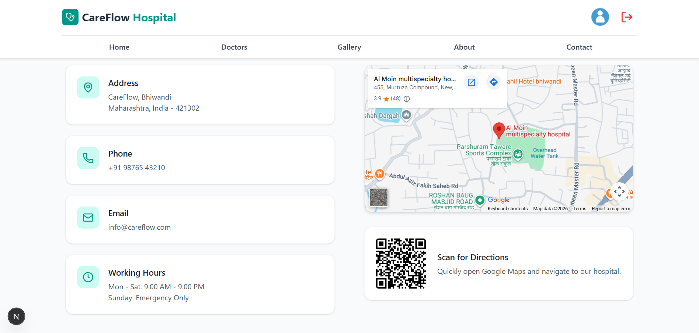

---

## 🛠️ Admin Side

### 📊 Dashboard
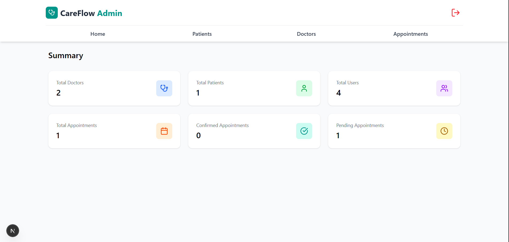

---

### 👥 Patient Management
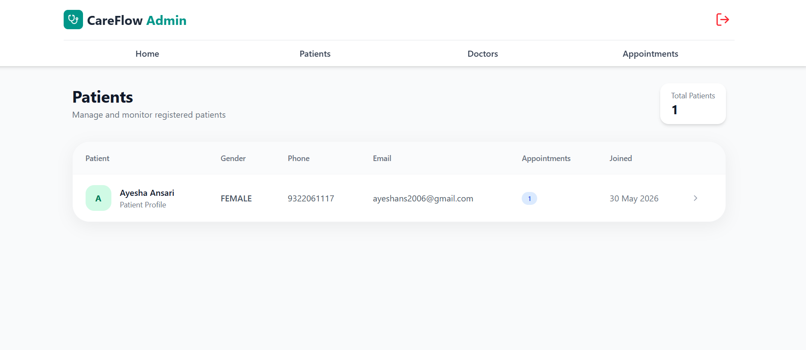

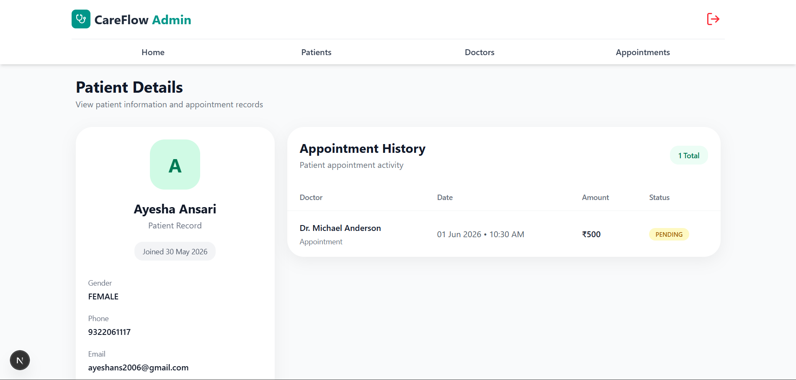

---

### 👨‍⚕️ Doctor Management
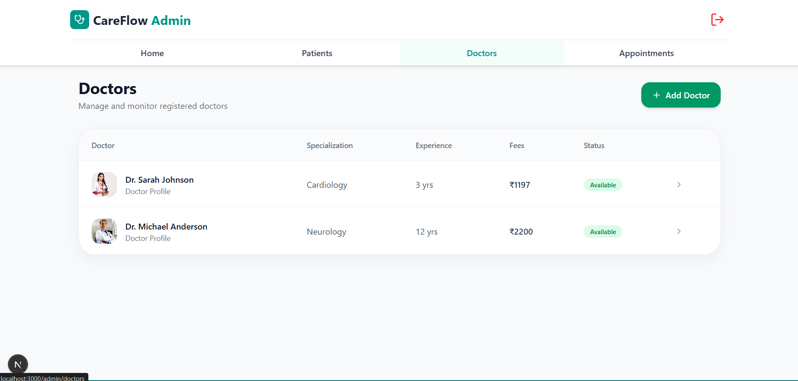

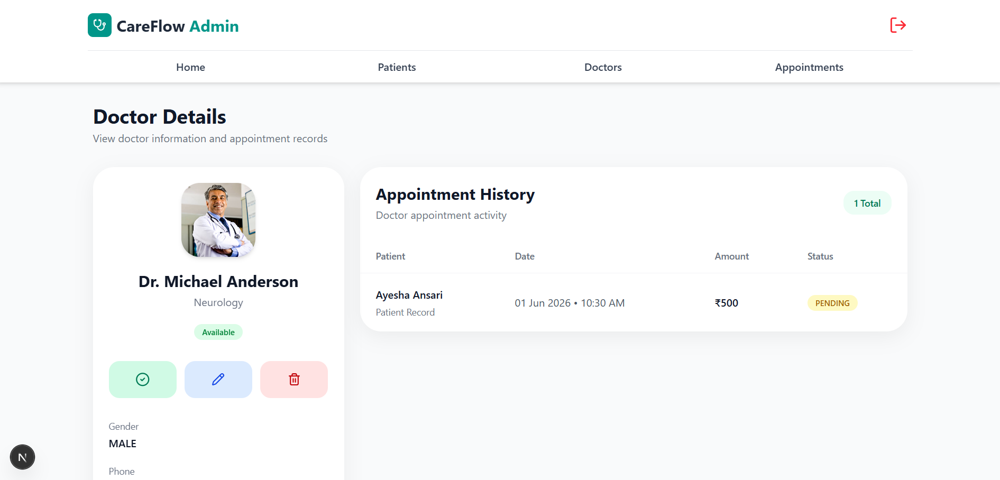

---

### 📅 Appointment Management
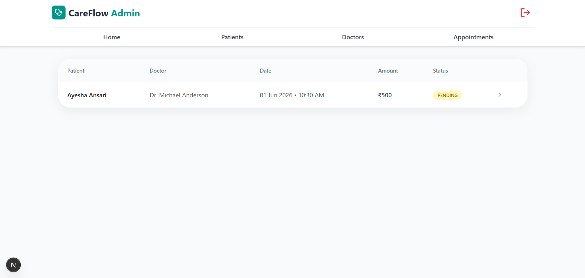

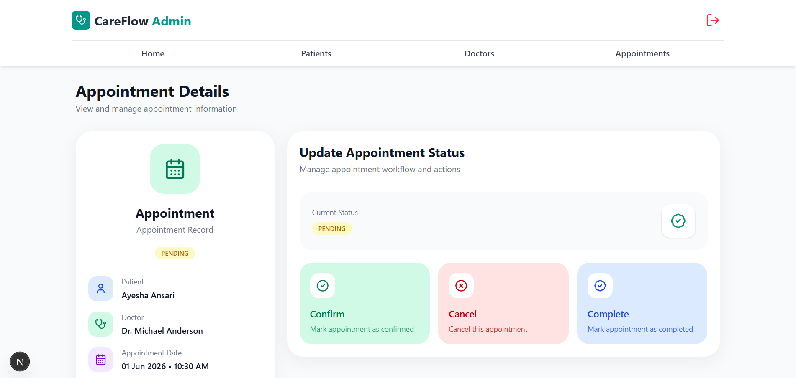

---

## 🧠 What I Learned

- Building role-based authentication systems
- Designing appointment booking workflows
- Managing relational data with Prisma ORM
- Implementing CRUD operations for hospital resources
- Creating reusable React components
- Building scalable applications using Next.js App Router
- Handling protected routes and authorization
- Managing appointment lifecycle states
- Database modeling and migrations with Prisma
- Developing admin dashboards and management systems

---

## 💡 Future Improvements

- Online Payments
- Email Notifications
- SMS Appointment Reminders
- Doctor Schedule Management
- Medical Record Storage
- Prescription Management
- Multi-Hospital Support
- Advanced Analytics Dashboard
- Seperate Doctor Module

---

## 👩‍💻 Author

**Ayesha Ansari**

Built with ❤️ using Next.js, React, Prisma, and Tailwind CSS.